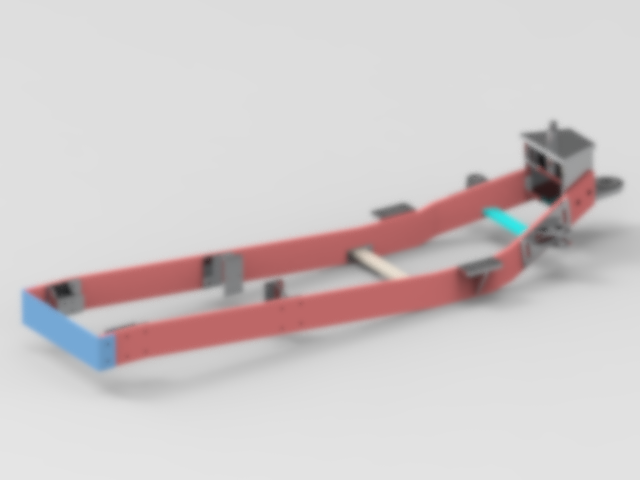
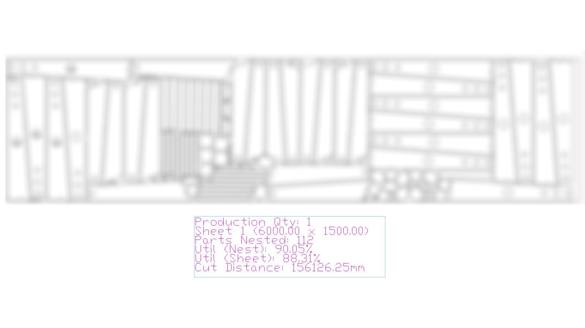

# akashpawar-portfolio

# Akash Santosh Pawar - Mechanical Design Engineer Portfolio

Welcome to my portfolio showcasing my expertise as a Mechanical Design Engineer. I specialize in 2D drafting, 3D modeling, and fabrication, with proficiency in AutoCAD, BricsCAD, and Solid Edge. With 1.4 years of experience at Trans-Mech Systems, 3 years running S S Engineers, and 9 months as an Assistant Professor, I bring a unique blend of design, manufacturing, and teaching skills. I hold a Master’s in Mechanical Design Engineering (CGPA 8.08) and am eager to contribute to global engineering projects, with a willingness to relocate internationally.

---

## Projects

### Tractor attachments Design (Trans-Mech Systems, Feb 2024 – Present)

- **Description**: Designed a front-end loader, front-end dozer, tractor chassis for sugercane infielder for agricultural tractors using Solid Edge for 3D modeling and AutoCAD for 2D drafting. Ensured compliance with industry standards and collaborated with manufacturing teams.
- **Skills**: Solid Edge, AutoCAD, 2D Drafting, 3D Modeling, Design for Manufacturing

### Material Optimization (Trans-Mech Systems, Feb 2024 – Present)

- **Description**: Optimized plate utilization for infielder chassis components using Solid Edge 2D nesting, achieving [10]% waste reduction and lowering production costs.
- **Skills**: Solid Edge 2D Nesting, Material Optimization, Cost Reduction

### Animal Feed Machinery Fabrication (S S Engineers, 2019–2020)

- **Description**: Designed and fabricated a conveyor system for an industrial client using AutoCAD for 2D drafting. Delivered on time. Managed procurement to achieve [10]% cost savings.
- **Skills**: AutoCAD, Fabrication, Project Management

### Assistant Professor/ Assistant Training & Placement Officer (Assistant Professor, 2021–2022)
- **Description**: Developed hands-on CAD training for undergraduate students using AutoCAD and Solid Edge.
- **Skills**: AutoCAD, Solid Edge, Technical Communication, Mentorship

---

## Education

**Master of Engineering (ME) in Mechanical Design Engineering**  
SVPM’s College of Engineering, Malegaon, Baramati, Maharashtra, India  
June 2018 – June 2020  
- CGPA: 8.08/10  

**Bachelor of Engineering (BE) in Mechanical Engineering**  
NBN Sinhgad College of Engineering (NBNSCOE), Solapur, Maharashtra, India  
June 2015 – May 2018  
- CGPA: 8.70/10  

**Diploma in Mechanical Engineering**  
SVPM’s Institute of Technology & Engineering, Malegaon, Baramati, Maharashtra, India  
June 2012 – May 2015  
- Percentage: 70%  

---

## Skills
- **CAD Software**: AutoCAD, BricsCAD, Solid Edge (2D & 3D)
- **Design Tools**: Solid Edge 2D Nesting
- **ERP Systems**: Customized BOM Management
- **Fabrication**: Manual and CNC Fabrication Techniques
- **Other Tools**: MS Office
- **Languages**: English (Intermediate), Hindi (Intermediate), Marathi (Native)

---

## Contact
- **Email**: [de.akashpawar@gmail.com]
- **LinkedIn**: [https://www.linkedin.com/in/de-akashpawar/]
- **GitHub**: [https://github.com/de-akashpawar/]
- **Portfolio**: [https://github.com/de-akashpawar/akashpawar-portfolio/]

I am available to relocate internationally and welcome opportunities to discuss how my skills can contribute to your team. Thank you for visiting my portfolio!

---

*Last Updated: May 2025*
